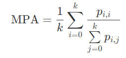
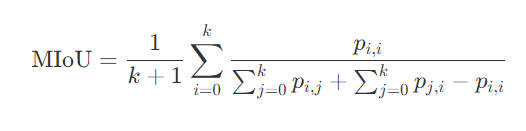
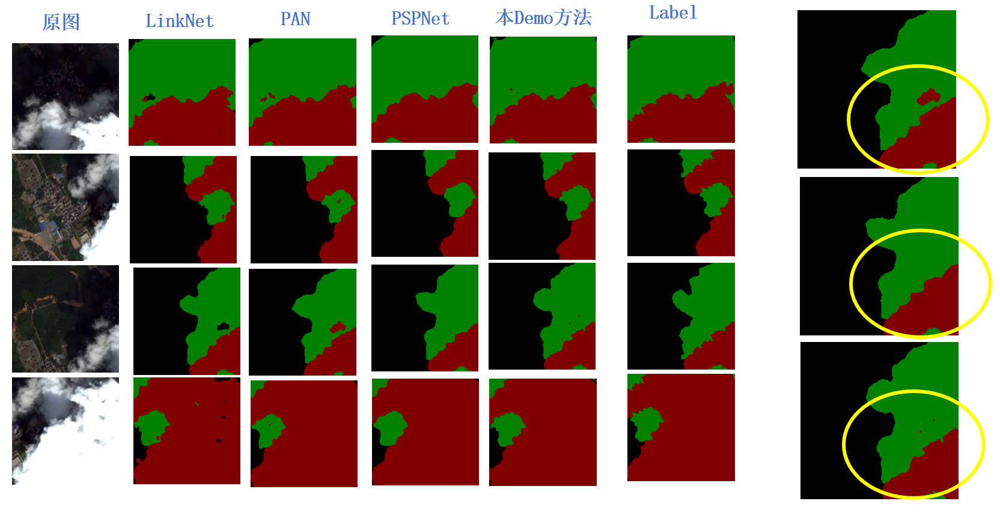
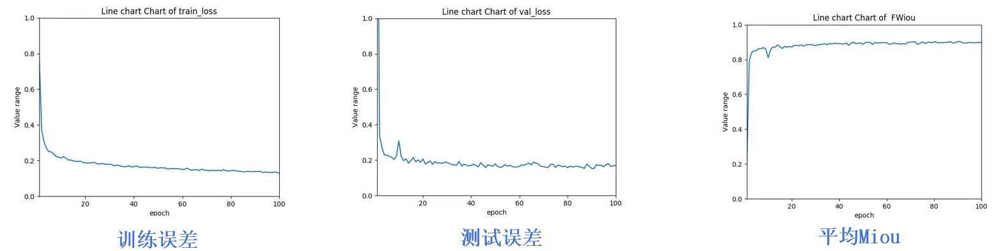
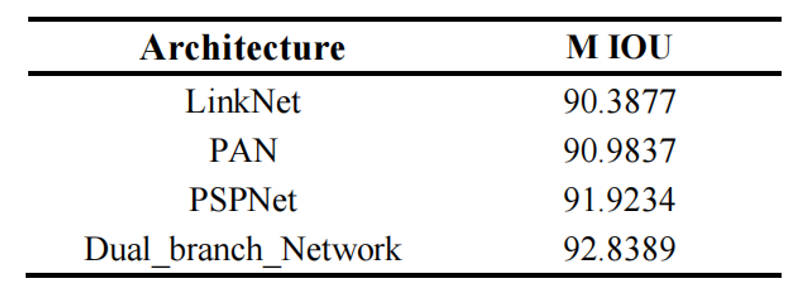

# Dual-Branch network for segmentation
  构建双分支(dual-branch)网络，利用Transformer和Convolution网络的优势，针对不同特征和语义背景下的云和云影的特征实施分割(segmentation)任务,进行不同程度的尝试，构建demo供更规范化的任务实施。
- ### 1.Some Introduction    
  随着深度学习在分割任务的广泛运用，针对特殊场景的分割技术也得到了蓬勃发展。云和云影的遥感图像的研究作为气象研究领域的重要组成部分，在气候变化和土地变化分类扮演了重要角色。本Demo在充分构思关于Transformer和Convolution构建的双分支神经网络的优越特性，提高不同尺度的云和云影的分割能力，并且进一步的理解编码和解码过程中，不同层级的特征和空间信息进行融合的过程，从而得到具有较好效果的分割网络模型。

- ### 2.Content
  datasetes---用于保存标签数据的显示颜色信息
  demo---存放了300张图片（均已经过裁剪）
  demo_img---是本次demo为了更好展示效果选择的4张图片
  picture_img---是本次demo对应的4张图片经过详细标注后的$准确Label$
  rs_aug---对图像进行处理和一些基本转换工具
  Dual_branch_Network.py---是基本的双分支网络框架

- ### 3.More Details 
#### 3.1网络主体框架
该网络中可以非常直观的发现基于双分支融合网络的遥感图像云和云影分割方法，通过Transformer分支和Convolution分支分别对遥感图像进行下采样提取多尺度特征，然后基于两分支不同的特性，使用双向引导模块使得两分支能够相互指导对方进行下采样，提高了不同尺度的语义信息和空间信息提取能力。同时，图中也重点的突出了解码阶段的作用，充分利用双分支提取到的特征进行上采样，逐步引导特征图的恢复，使得云和云影的定位更加准确、分割边界更加清晰，最终生成分割结果。

#### 3.2数据集处理和编码-解码思路介绍
(1) 数据集的处理
从Landsat-8号卫星和Sentinel-2号卫星上获取高清遥感图像，并且对遥感图像进行裁剪。对完成裁剪的图像进行标注，并且使用Labelme对裁剪完成的图像进行人工掩膜标注，并将宝珠类型分为：云、云影和背景三类，并且划分出训练集和验证集。
(2) 编码-解码的思路分析
将图像输入到Transformer分支和卷积分支的网络模型中，通过多次下采样获得遥感图像的不同尺度的特征信息，为特征融合做准备。
在$编码$阶段，使用Transformer和卷积网络相互引导的双分支结构去提取不同层次的特征，融合全局特征和局部特征；
在$解码$阶段，使用Transformer分支和条状卷积分支提取到的不同层次的语义信息和空间信息进行上采样，融合高级语义信息和空间位置信息，实现云和云影的精准定位和精细分割。
并且其中利用双向引导模块引导Transformer分支和卷积分支进行特征提取。

#### 3.3抽象化模块的具象化表述

**因为Github的Markdown格式公式显示会出现一些问题，以下公式较多的地方，将用截图形式进行插入**

##### (1)Transformer分支的表达式

##### (2)Convolution分支的表达式

##### （3）解码阶段

#### 3.4评价指标介绍
本文的部分的评价指标如下，用于衡量构建的深度神经网络的性能。MPA( Mean Pixel Accuracy)也叫像素精度，是图像分割任务中常用的评价指标之一，其计算方法是将模型预测正确的像素数除以总像素数:

其中，正确预测的像素数是指模型预测的像素标签与真实像素标签完全一致的像素数，总像素数是指图像中所有像素的数量。
MIoU(Mean Intersection over Union),也叫平均交并比，是图像分割任务中常用的另一个评价指标，其计算方法是将每个类别的交并比取平均值

其中，类别交集是指模型预测的像素标签与真实像素标签都为某个特定类别的像素数，类别并集是指模型预测的像素标签或真实像素标签为某个特定类别的像素数。MIoU的值越大，表示模型的分割结果越准确。

#### 3.5一些结果
不同方法的对比结果

训练过程

MIOU

  
